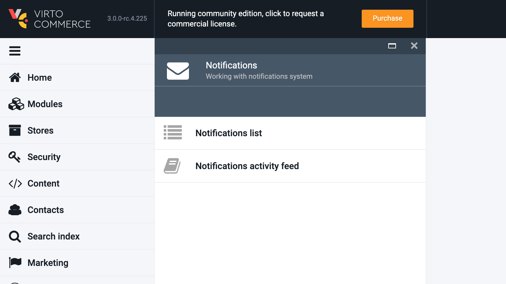

# Virto Commerce Notification Module

    

The Notification module provides a comprehensive infrastructure for managing and delivering notifications within the Virto Commerce platform. It encompasses the following key components:

* **Notification list**: This feature allows administrators and users to view and manage a list of notifications. The notification list provides an overview of all active and past notifications, allowing for easy tracking and monitoring.
* **Notification templates and layouts**: The module includes a flexible system for creating and managing notification templates and layouts. It leverages the power of Scriban (with Liquid support enabled) to enable dynamic content generation, making it easy to customize and personalize notifications.
* **Notification activity feed**: The activity feed feature provides a centralized hub where users can access and review all notification-related activities. It offers a comprehensive view of the notification history, including delivery status and recipient interactions.

The Notification module empowers businesses to effectively manage and deliver notifications, enabling personalized and timely communication with customers and stakeholders. With its versatile features and robust infrastructure, it ensures a seamless and engaging user experience.

## Key features

* **Email templates with Scriban**: The module supports email templates using the powerful Scriban templating language, with Liquid support enabled. This allows for dynamic content generation and customization of email notifications, ensuring personalized and engaging communication with recipients.
* **Extendable model**: The notifications module offers an extendable model, allowing developers to add custom fields and attributes to notifications as per their specific business requirements. This flexibility enables seamless integration with existing systems and workflows.
* **SMTP and SendGrid support**: The module provides support for multiple email delivery options, including SMTP and SendGrid. This ensures reliable and efficient email delivery, enabling seamless communication with customers and stakeholders.
* **Async delivery with retry policy**: To enhance performance and reliability, the notifications module implements asynchronous delivery with a built-in retry policy. This ensures that notifications are delivered promptly and efficiently, even in case of temporary failures or network interruptions.

## Documentation

* [Notification module user documentation](https://docs.virtocommerce.org/platform/user-guide/notifications/overview/)
* [Notification module developer guide](https://docs.virtocommerce.org/platform/developer-guide/Fundamentals/Notifications/overview/)
* [REST API](https://virtostart-demo-admin.govirto.com/docs/index.html?urls.primaryName=VirtoCommerce.Notifications)  
* [View on GitHub](https://github.com/VirtoCommerce/vc-module-notification/)
* [Liquid as Primary Template Language](https://community.virtocommerce.com/t/liquid-as-primary-template-language/78)
* [Creating Email templates](https://docs.virtocommerce.org/platform/user-guide/notifications/notification-templates/)

## References

* [Deployment](https://docs.virtocommerce.org/platform/developer-guide/Tutorials-and-How-tos/Tutorials/deploy-module-from-source-code/)
* [Installation](https://docs.virtocommerce.org/platform/user-guide/modules-installation/)
* [Home](https://virtocommerce.com)
* [Community](https://www.virtocommerce.org)
* [Download latest release](https://github.com/VirtoCommerce/vc-module-notification/releases/latest)

## License

Copyright (c) Virto Solutions LTD.  All rights reserved.

Licensed under the Virto Commerce Open Software License (the "License"); you
may not use this file except in compliance with the License. You may
obtain a copy of the License at http://virtocommerce.com/opensourcelicense.

Unless required by the applicable law or agreed to in written form, the software
provided under the License is distributed on an "AS IS" BASIS,
WITHOUT WARRANTIES OR CONDITIONS OF ANY KIND, either express or
implied.
