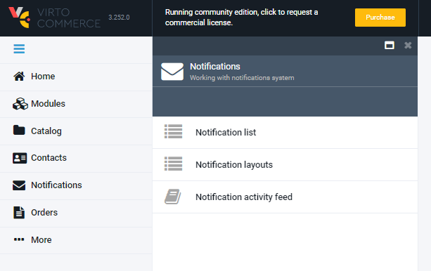
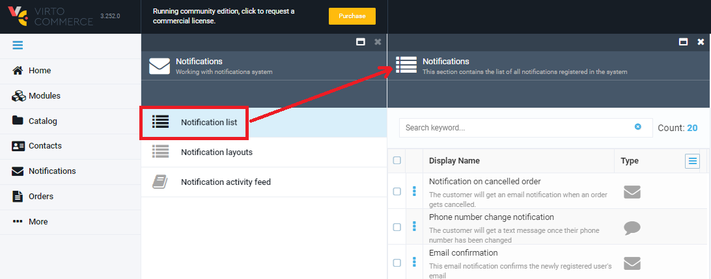

# vc-module-notifications

The Notifications module supports notifications infrastructure and consists of two main blocks:

1. Notifications list
1. Notification activity feed

## Notifications list

The Notifications list block of Notifications module contains all types of notifications and notification templates registered in VC business modules.

The following modules are connected with the Notifications module by default:

1. Customer module;
1. Orders module;
1. Subscription module.

By default the Notification module supports two types of notifications:

1. Email notifications;
1. SMS notifications.

These notifications types are provided by VC settings out-of-the-box. But the system also allows register new notifications types from a third party module, integrated with VC.

### Notification Details

1. Open Notifications module->Notifications list and select a notification from the list;
1. The system displays the Notification details blade:
     1. 'Is Active' button allows activate or de-activate the selected notification;
     1. 'Notification name' field is a label and can not be edited;
     1. 'From'- this field has a default value, but is active and you can add additional email addresses in case of need;
     1. 'To'- this field is blank by default and you should enter the recipient email address here;
     1. 'CC recipient' field has a default value, but the system allows enter additional email addresses;
     1. 'BCC' field is blank by default. You can enter as many emails as needed.

### Notification Template

1. On 'Notifications details' blade select the 'Templates' widget and then select the Template from the list on 'Manage notification templates' blade;
1. You can select the language for your template, edit the subject and the template content;
1. To preview the template content, select  the 'Preview' tab;
1. Changes made to the template should be saved.

### Notification logs

VC Notification module saves notification activity logs and store them under 'Notification sending log'.

To view the sending logs, select the notification, open 'Notification details' and select the 'Send log' widget.
The system will display the existing logs on the 'Notification sending logs' blade.

 **Important** 
 
 1. Notification templates are customizable;
 There is no possibility to create new notifications in Notifications module;
 1. All notifications are predefined and registered by VC business modules. Only registered notifications appear in Notifications module;
 1. There is no possibility to delete the notification in Notifications module.

## Notification activity feed

This block of the Notification module displays the list of all notification recorders that were created in the system by the business modules. 

In order to view the notification details, simply select the Notification you need and the system will display the Notification Info on a separate blade.

## Documentation

[What’s customer_order object in the notifications templates](https://community.virtocommerce.com/t/whats-customer-order-object-in-the-notifications-templates/97)

[Liquid as Primary Template Language](https://community.virtocommerce.com/t/liquid-as-primary-template-language/78)

## License

Copyright (c) Virto Solutions LTD.  All rights reserved.

Licensed under the Virto Commerce Open Software License (the "License"); you
may not use this file except in compliance with the License. You may
obtain a copy of the License at

http://virtocommerce.com/opensourcelicense

Unless required by applicable law or agreed to in writing, software
distributed under the License is distributed on an "AS IS" BASIS,
WITHOUT WARRANTIES OR CONDITIONS OF ANY KIND, either express or
implied.