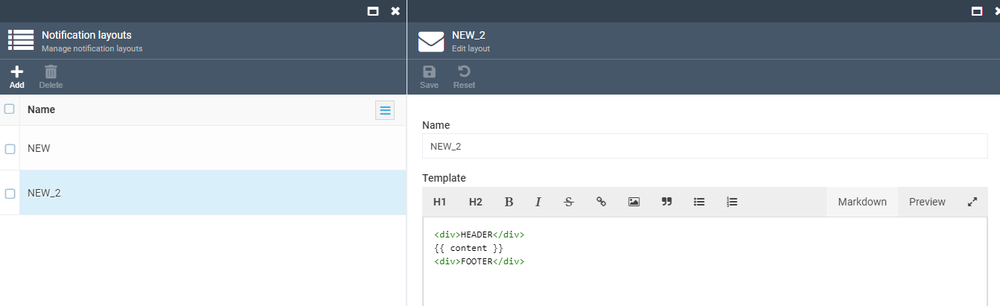
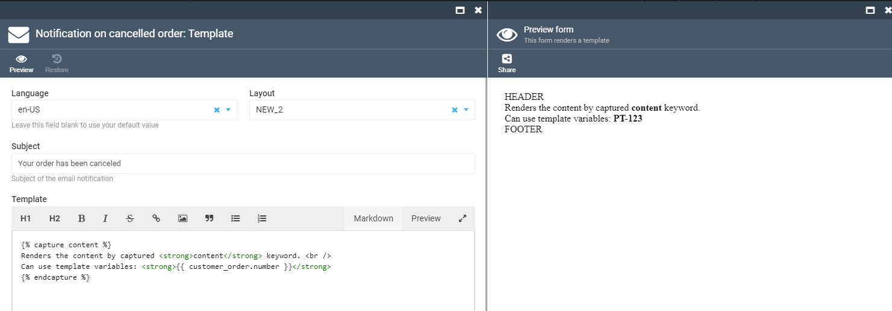
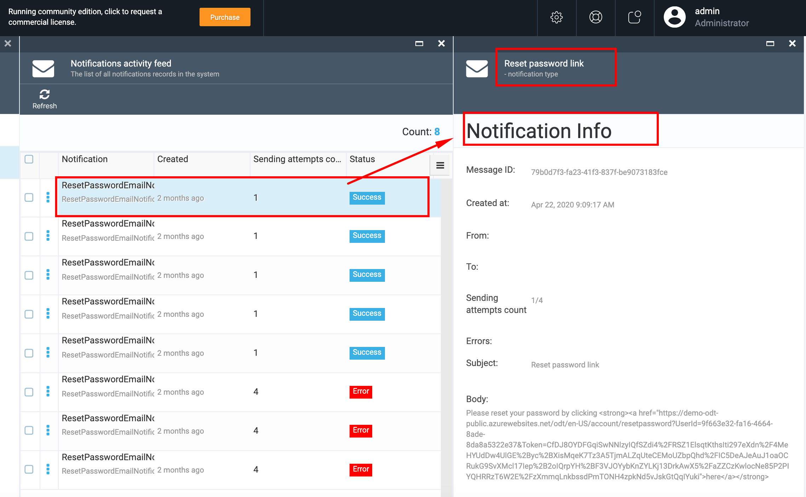

# Overview

The Notifications module supports notifications infrastructure and consists of two main blocks:

1. Notifications list;
1. Notification activity feed.


## Key Features

1. Email Templates with Liquid;
1. Extendable Model;
1. Supports SMTP and SendGrid;
1. Async delivery with retry policy.

## Notifications list

The Notifications list block of Notifications module contains all types of notifications and notification templates registered in VC business modules.


The following modules are connected with the Notifications module by default:

1. Customer module;
1. Orders module;
1. Subscription module.

By default the Notification module supports two types of notifications:

1. Email notifications;
1. SMS notifications.

These notifications types are provided by VC settings out-of-the-box. But the system also allows register new notifications types from a third party module, integrated with VC.

### Notification Details

1. Open Notifications module->Notifications list and select a notification from the list;
1. The system displays the Notification details blade:
     1. 'Is Active' button allows activate or de-activate the selected notification;
     1. 'Notification name' field is a label and can not be edited;
     1. 'From'- this field has a default value, but is active and you can add additional email addresses in case of need;
     1. 'To'- this field is blank by default and you should enter the recipient email address here;
     1. 'CC recipient' field has a default value, but the system allows enter additional email addresses;
     1. 'BCC' field is blank by default. You can enter as many emails as needed.


### Liquid language
A liquid syntax used to describe email templates. Scriban library used to render liquid. Therefore the user can write liquid templates as well as scriban templates. [Take a reference](https://github.com/scriban/scriban/blob/master/doc/liquid-support.md) to Scriban library for detailed liquid syntax description.

### Notification Template

1. On 'Notifications details' blade select the 'Templates' widget and then select the Template from the list on 'Manage notification templates' blade;
1. You can select the language for your template, edit the subject and the template content;
1. To preview the template content, select  the 'Preview' tab;
1. Changes made to the template should be saved.


### Notification Layouts

VC Notification module provides email notification template layout functionality so you can simplify email notification management of footer, header, etc.

1. On the 'Notifications' menu select 'Notification layouts' and add a new layout. Layout body is a Liquid template that will be populated by email content on rendering. Define a special variable, for example `content`, and place it between your html header and footer, for example: 
```html
<div>HEADER</div>
     {{ content }}
<div>FOOTER</div>
```



2. Open email template. For layout to render correctly you need to first select it in the Layout dropdown. Then after selecting a layout you need to provide content for the `content` variable defined inside the layout earlier. You can do it by placing it inside `capture` clause, for example:
```liquid

     Renders the content by captured <strong>content</strong> keyword. <br />
     Can use template variables: <strong>{{ customer_order.number }}</strong> 

``` 
3. You can check correctness of your email notification by clicking the Preview button:


*Note*: you can have more than one content variable in a layout, they will be rendered as long as captured inside the notification template.

4. Save changes to the notification template.

### Notification logs

VC Notification module saves notification activity logs and store them under 'Notification sending log'.

To view the sending logs, select the notification, open 'Notification details' and select the 'Send log' widget.
The system will display the existing logs on the 'Notification sending logs' blade.


 **Important** 
 
 1. Notification templates are customizable;
 There is no possibility to create new notifications in Notifications module;
 1. All notifications are predefined and registered by VC business modules. Only registered notifications appear in Notifications module;
 1. There is no possibility to delete the notification in Notifications module.

## Notification activity feed

This block of the Notification module displays the list of all notification recorders that were created in the system by the business modules. 

In order to view the notification details, simply select the Notification you need and the system will display the Notification Info on a separate blade.



