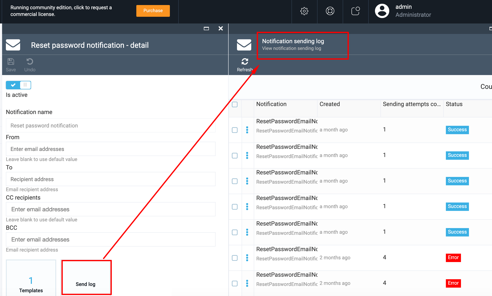

# Overview

The *Notifications* module supports notification infrastructure and consists of the following:

1. Notification list
1. Notification templates layouts
1. Notification activity feed


## Key Features

1. Email templates with Scriban (Liquid support enabled)
1. Extendable model
1. Support for SMTP and SendGrid
1. Async delivery with retry policy

## Notification List

The *Notification List* section of the *Notifications* module contains all types of notifications and notification templates registered by running modules.


The following modules from the commerce bundle declare notifications by default:

1. Customer module
1. Orders module
1. Subscription module

There are two basic types of notifications supported:

1. Email notifications
1. Text message (SMS) notifications

These notification types are provided by VC settings out-of-the-box. The system also allows you to register new notification types coming from third party modules integrated with Virto Commerce.

## Email Notification Details

1. Open the *Notifications* module, navigate to *Notifications list* and select a notification with the email type.
1. The system will display the *Notification details* screen with the following elements:
     + The *Active* enables or disables the selected notification.
     + The *Notification name* field is a label and cannot be edited.     
     + The *CC recipient* field has a default value, although you can enter an additional email addresses.
     + The *BCC* field is blank by default. You can enter as many emails as you need.


### Notification Templates
Every notification can have one or more templates to render the notification in different languages.

Scriban/Liquid syntax is used to describe email templates. As Scriban library is leveraged to render notifications, you can write both Liquid and Scriban templates. For more information on Liquid syntax, go [here](https://github.com/scriban/scriban/blob/master/doc/liquid-support.md).

## Editing Notification Template

On the *Notifications details* screen, select the *Templates* widget, and then select the template from the list on the *Manage notification templates* screen:


On the *Template details* screen, you can:
1. Select language for your template.
1. Select layout for your template (if applicable).
1. Edit email subject.
1. Edit template for the email body.
1. Edit the sample data JSON file (scroll the screen to the bottom):


6. Click *OK* to save the template or *Cancel* to discard your changes.

### Reverting Template and Sample Data to Predefined State
Most of the notifications have predefined templates and sample data. You can use them as a base for your custom template. Predefined templates are shipped within notification hosting modules.

To revert your notification template and sample data to the predefined state, click the *Restore* button:


### Previewing Notification and Sending Test Email
To preview the rendered email, click the *Preview* button on the top of the screen. The template will be rendered with the object described in the sample data JSON file, and the result will be shown in a separate screen:


The preview screen shows the sample of the email body. All styles in the preview screen are in the default state and you can see the sample on the *as is* basis.
Unfortunately, different email clients show HTML markups in a slightly different way and not exactly as it is in the browser with the default styles.

We encourage you to refer to our [template construction tips](tips-and-tricks-for-creating-email-templates.md) to understand the basics of template development and avoid typical problems with email client differences.

You can send the preview to someone to ensure the body looks well in your email client software using the *Share* button:


Enter the email address in question and click *Confirm*.

## Working with Layouts

Template layout is a common part of the notification template subset. It may come in handy to extract common parts of the notification body into a separate document to simplify the editing process of common notification parts, such as footer, header, etc.

The layout feature is implemented with the Scriban *capture* [statement](https://github.com/scriban/scriban/blob/master/doc/language.md#96-capture-variable--end).

Let's take a close look to the example to understand how it works:

1. In the *Notifications* menu, select *Notification layouts* and add a new layout. The layout body is a template that will be populated together with notification template on email body rendering. Define a special variable within the body, for example, *content*, and place it between header and footer, e.g.:

```html
<div>HEADER</div>
     {{ content }}
<div>FOOTER</div>
```

The `{{ content }}` statement inserts a part of the notification template with the `content` name into the resulting document.

We are assuming here that the `content` variable contains the result of rendering a named part of the notification template.


2. To use this layout, open the email template. Select the created layout in the dropdown list and provide the template code for the `content` variable. You should do it with the `capture` statement, e.g.:

```html

     Renders the content by captured <strong>content</strong> keyword. <br />
     Can use template variables: <strong>{{ customer_order.number }}</strong> 

``` 

3. As usual, you can check whether your email notification is correct by clicking the *Preview* button:


As you can see on the sample image, the template was rendered with the use of layout.

!!! note
    You can have as many variables in a layout as you want; they will be captured from the notification template.

Obviously, the same layout with the variable values varying from template to template helps you manage common notification body parts easily.

4. <ake sure to save changes in the notification template.

## Notification Logs

Virto's *Notifications* module saves notification activity logs and stores them under the *Notification log*.

To view the logs, select the notification, open *Notification details* and select the *Send log* widget.
    
The system will display the existing logs on the *Notification sending logs* screen:



 ## Notification Activity Feed

Thissection of the *Notifications* module displays the list of all notification recorders created within the system by the business modules. 

To view the notification details, select the notification in question, and the system will display the notification info on a separate screen:


