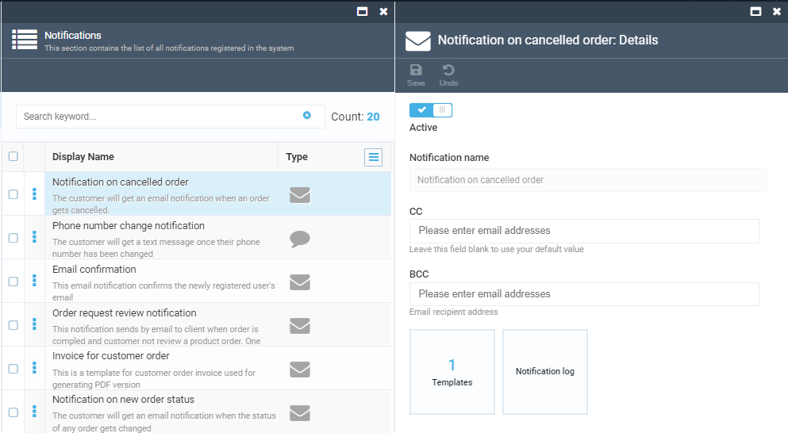
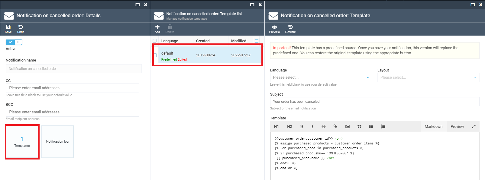
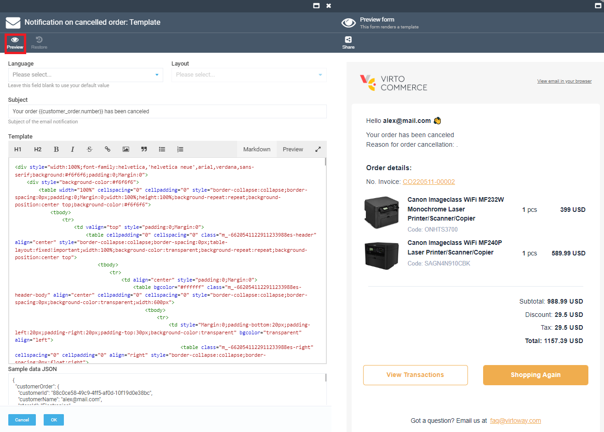

# Overview

The Notifications module supports notification infrastructure and consists of:

1. Notifications list
1. Notification templates layouts
1. Notification activity feed


## Key Features

1. Email Templates with Scriban (Liquid support enabled);
1. Extendable Model;
1. Supports SMTP and SendGrid;
1. Async delivery with retry policy.

## Notifications list

The Notifications list block of Notifications module contains all types of notifications and notification templates registered by running modules.


The following modules from the commerce-bundle declare notifications by default:

1. Customer module;
1. Orders module;
1. Subscription module.

There are two basic types of notifications supported:

1. Email notifications;
1. SMS notifications.

These notifications types are provided by VC settings out-of-the-box. But the system also allows register new notifications types from a third party module, integrated with VC.

## Email notification Details

1. Open Notifications module->Notifications list and select a notification with email type from the list;
1. The system displays the Notification details blade:
     1. 'Is Active' button allows activate or de-activate the selected notification;
     1. 'Notification name' field is a label and can not be edited;     
     1. 'CC recipient' field has a default value, but the system allows enter additional email addresses;
     1. 'BCC' field is blank by default. You can enter as many emails as needed.



### Notification templates
Every notification can have one or more templates to render the notification in different languages.

Scriban/Liquid syntax is used to describe email templates. As Scriban library is leveraged to render notifications, you can write liquid templates as well as scriban templates. For more information on liquid syntax, go [here](https://github.com/scriban/scriban/blob/master/doc/liquid-support.md).

## Edit notification template

On 'Notifications details' blade select the 'Templates' widget and then select the template from the list on 'Manage notification templates' blade.



Look at the template details blade, you can:
1. Select the language for your template
1. Select the layout for your template (if applicable)
1. Edit the subject of the mail
1. Edit the template for the mail body
1. Edit the sample data json (scroll the blade to the bottom):


6. Click `OK` button to save the template or `Cancel` to discard

### Revert the template and sample data to a predefined state
Most of the notifications have predefined templates and sample data. You can take these as a base for your custom template. Predefined templates is shipping within notification hosting modules.

To revert your notification template and sample data to the predefined state, click the `Restore` button:


### Preview the notification and send the test mail
To preview the rendered email, click the `Preview` button at the top of the blade. The template will be rendered with the object described in the 'sample data json', and the result presented in the separate blade:



The preview blade shows the sample of the mail body. All styles in the preview blade dropped to the default state and you see the sample on "AS IS" basis.
Unfortunately, different email clients show HTML-markups in a slightly different way and not exactly as it is in the browser with default styles set. 

Please take a reference to our [template construction tips](tips-and-tricks-for-creating-email-templates.md) to understand the basics of template development and avoid of typical problems with email client differences.

You can send the preview to someone to ensure the body looks well in your email client software.
Press `Share` toolbar button to send:


Then enter desired address and press `Confirm`.

## Working with layouts

Template layout is a common part of notification templates subset. It is useful to extract common parts of the notification body into a separate document to simplify edit of common notification parts (footer, header, etc).

Layouts functionality implemented with use of Scriban `capture` [statement](https://github.com/scriban/scriban/blob/master/doc/language.md#96-capture-variable--end).

Let's take a close look to the example to understand how this works:

1. On the 'Notifications' menu select 'Notification layouts' and add a new layout. Layout body is a template that will be populated together with notification template on email body rendering. Define inline in the body a special variable, for example `content`, and place it between some header and footer, for example: 
```html
<div>HEADER</div>
     {{ content }}
<div>FOOTER</div>
```
`{{ content }}` statement inserts a part of the notification template with name `content` into resulting document.
Just imagine the variable `content` contains the result of rendering some named part of notification template.


2. To use this layout, open email template. Select the created layout in the dropdown. Then provide template code for the `content` variable. You should do it with `capture` statement, for example:
```html

     Renders the content by captured <strong>content</strong> keyword. <br />
     Can use template variables: <strong>{{ customer_order.number }}</strong> 

``` 
3. As usual, you can check correctness of your email notification by clicking the `Preview` button:


As you can see at the sample image, the template was rendered with use of layout.

*Note*: you can have as many variables in a layout as you want, it will render them captured from the notification template.

It's obvious, the same layout but different variable values from template to template helps to manage common notification body parts with easy.

4. Don't forget to save changes to the notification template.

## Notification logs

VC Notification module saves notification activity logs and store them under 'Notification sending log'.

To view the sending logs, select the notification, open 'Notification details' and select the 'Send log' widget.
The system will display the existing logs on the 'Notification sending logs' blade.


 ## Notification activity feed

This block of the Notification module displays the list of all notification recorders that were created in the system by the business modules. 

In order to view the notification details, simply select the Notification you need and the system will display the Notification Info on a separate blade.


