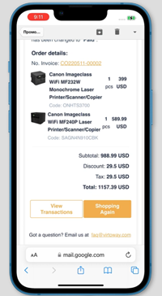

# Creating Email Templates
Coding email templates is not easy because each email service has its own features. Moreover, something may not be supported or may look different compared to other service or on different devices. Here are some useful tips and tricks you can leverage to work with email templates correctly:

1. Try to declare styles for every individual element within its style attribute , e.g., `<element style=”style:value;”></element>`. This is also known as *inline CSS*. If you use internal CSS, i.e. styles written within the `<style>` element), in email templates, different services and devices may display your template in a different manner, or even completely ignore your CSS.

Correct template with internal CSS

Template with internal CSS displayed in Gmail

Template with internal CSS displayed in Outlook

2. Styles in Outlook service do not work within the `<a>` tag. Use `` or `
` instead.

3. If you need to add small images or icons into your template, try to use the *base64* format; this way, you will avoid uploading images to a services, while those images will be displayed in a similar way regardless of the service. <strong>Please note, however, that some services, such as Gmail.com, do not always successfuly display *base64* images.</strong>

4. Try to set widths in every cell rather than in a table. With widths in the table, widths in the cells, HTML margins and padding, and CSS margins and padding, you may end up in a complete mess.

5. If the spacing is critical to you, try nesting tables inside your main table. Even though margins and padding are supported by most email clients, the result may be inconsistent.

Template displayed in iPhone emulator (iOS 15.0, Safari) without using any table for buttons

Template displayed in iPhone emulator (iOS 15.0, Safari) using a table for buttons

